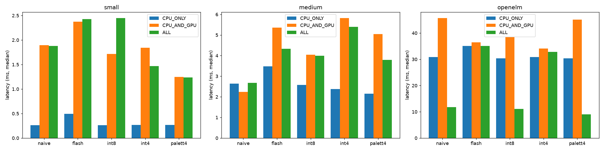
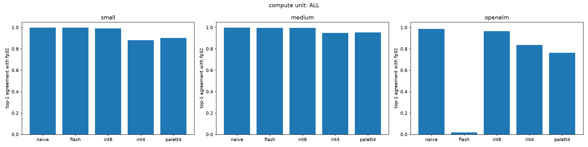

# llm-inference-macOS

How three language models of different sizes behave when converted to Core ML and run on Apple silicon, with and without **quantization**, **palettization** and **flash attention**: how fast they run, how big they are, and how accurate they stay.

Measured on an Apple M4 (16 GB), macOS 26.6, torch 2.7.0, coremltools 9.0.

## Models

| Model | Params | What it is |
|---|---|---|
| small | 0.8M | Our decoder-only transformer (4 layers, width 128), trained on tinyshakespeare |
| medium | 19M | The same architecture (6 layers, width 512), trained the same way |
| OpenELM-270M | 271M | Apple's pretrained model, downloaded from HuggingFace |

The small and medium models are trained in [`train.py`](train.py) on character-level next-character prediction with **cross-entropy loss**: the loss at each position is −log(probability the model gave to the character that actually comes next), averaged over positions. The last 10% of the text is held out and used only for evaluation. Final held-out loss: small 1.81, medium 1.63.

## Variants of each model

| Variant | What changes |
|---|---|
| naive | Baseline: fp16 (Core ML's default precision), standard attention `softmax(QKᵀ/√d)·V` |
| flash | Same model, attention computed Flash-Attention style: keys processed in blocks of 16 with a running max and sum ("online softmax"), so the full 64×64 score matrix is never built. Identical math |
| int8 | Weights stored as 8-bit integers plus one scale per output channel |
| int4 | Weights stored as 4-bit integers plus one scale per block of 32 weights |
| palett4 | Palettization: k-means picks 16 representative values per group of 16 output channels, and each weight is stored as a 4-bit index into that table |

Compression is applied only to the weight matrices and the embedding table ([`compress.py`](compress.py)).

## How it's measured

**Where it runs.** Core ML can run a model on the CPU, the GPU or the Neural Engine (ANE), selected with `compute_units`:
- `CPU_ONLY`: CPU only.
- `CPU_AND_GPU`: CPU plus GPU.
- `ALL`: also allows the Neural Engine. Core ML's scheduler decides per op, so `ALL` doesn't guarantee the ANE is used.

The benchmark reports how many ops the scheduler places on each device.

**Latency.** Median time of `predict()` over 50 calls on a 64-token input, after 10 warm-up calls ([`benchmark.py`](benchmark.py)).

**Accuracy** ([`evaluate.py`](evaluate.py)). Compared with the original fp32 PyTorch model on 32 windows of 64 tokens of held-out text:
- **Perplexity** is exp(average cross-entropy on the true next token), the training loss exponentiated. Roughly, it's how many tokens the model is effectively choosing between, so lower is better. It measures *how good the model still is at predicting real text*.
- **Top-1 agreement** is the fraction of positions where the model's most likely next token is the same as the fp32 model's. It measures *how closely the converted model still behaves like the original*; 1.0 means identical choices.

## Results

### Latency and size

Median ms per forward pass (64 tokens). Source: [`results/benchmark.csv`](results/benchmark.csv).

| model | variant | size (MB) | CPU_ONLY | CPU_AND_GPU | ALL | where ALL runs |
|---|---|---|---|---|---|---|
| small | naive | 1.7 | **0.26** | 1.90 | 1.88 | GPU |
| small | flash | 1.8 | 0.49 | 2.37 | 2.43 | GPU |
| small | int8 | 0.9 | 0.26 | 1.72 | 2.45 | GPU |
| small | int4 | 0.5 | 0.27 | 1.84 | 1.47 | GPU |
| small | palett4 | 0.5 | 0.27 | 1.25 | 1.24 | GPU |
| medium | naive | 38.1 | 2.65 | 2.24 | 2.67 | GPU |
| medium | flash | 38.3 | 3.48 | 5.36 | 4.33 | GPU |
| medium | int8 | 19.2 | 2.58 | 4.04 | 3.99 | GPU |
| medium | int4 | 10.9 | 2.38 | 5.82 | 5.40 | GPU |
| medium | palett4 | 9.8 | 2.15 | 5.04 | 3.79 | GPU |
| OpenELM | naive | 544 | 30.9 | 45.7 | **11.8** | ANE |
| OpenELM | flash | 544 | 35.1 | 36.5 | 35.1 | fails on ANE (see below) |
| OpenELM | int8 | 273 | 30.3 | 38.4 | **11.1** | ANE |
| OpenELM | int4 | 153 | 30.9 | 34.1 | 32.8 | GPU |
| OpenELM | palett4 | 137 | 30.4 | 45.2 | **9.0** | ANE |



### Accuracy (compute unit `ALL`)

Source: [`results/accuracy_ALL.csv`](results/accuracy_ALL.csv). [`results/accuracy_CPU_ONLY.csv`](results/accuracy_CPU_ONLY.csv) gives the same numbers on the CPU, except for OpenELM flash.

| variant | small: perplexity / agreement | medium: perplexity / agreement | OpenELM: perplexity / agreement |
|---|---|---|---|
| fp32 PyTorch (reference) | 6.23 / 1.000 | 5.16 / 1.000 | 48.99 / 1.000 |
| naive (fp16) | 6.23 / 0.999 | 5.16 / 0.998 | 48.99 / 0.987 |
| flash | 6.23 / 0.999 | 5.16 / 0.997 | **21,179 / 0.019** (CPU: 49.02 / 0.985) |
| int8 | 6.23 / 0.992 | 5.16 / 0.996 | 49.03 / 0.965 |
| int4 | 6.50 / 0.881 | 5.17 / 0.948 | 53.54 / 0.835 |
| palett4 | 6.33 / 0.903 | 5.19 / 0.953 | 57.13 / 0.763 |



## What the results show

- **int8 costs essentially nothing.** Perplexity stays within 0.1% of fp32 for all three models, at half the size.
- **4-bit costs some accuracy, and how much depends on the model.** The medium model barely changes (+0.1–0.5% perplexity). OpenELM loses more: +9% with int4 and +17% with palettization. At the same 4 bits, palettization is more accurate than int4 on the small model but less accurate on OpenELM.
- **Smaller isn't always faster.** On OpenELM, int8 and palett4 run on the Neural Engine (11.1 and 9.0 ms), but Core ML runs int4 on the GPU, so it's no faster than the CPU (32.8 ms).
- **Only OpenELM uses the Neural Engine,** where it's 2.6× faster than on the CPU (11.8 vs 30.9 ms). The small and medium models always run on the GPU under `ALL`. At this size, the CPU is as fast or faster: 0.26 ms on CPU against about 1.9 ms on GPU for the small model.
- **Flash attention is slower here and gives no benefit.** It produces the same outputs but converts to about 3.5× more ops (99 → 343 for the small model), and it's slower on every compute unit. Flash Attention pays off on long sequences, where the full attention matrix doesn't fit in fast memory. At 64 tokens the matrix is only 64×64, so tiling just adds work.
- **OpenELM with flash attention gives wrong output on `ALL`.** Core ML's Neural Engine compiler fails on this model (`failed to compile ANE model`), and the `ALL` output is wrong (agreement 0.02), even though it's correct on the CPU and GPU. We didn't investigate further; use naive attention on the ANE.

## Fixes that were needed

1. **Scale Q before QKᵀ (fp16 overflow).** In the trained medium model, `Q·Kᵀ` reached 189,730 before dividing by √d. That's above fp16's maximum of 65,504, so Core ML's output was NaN. Computing `(Q/√d)·Kᵀ` is the same math, but the largest intermediate is 23,716 ([`transformer.py`](transformer.py)).
2. **A fixed input length (64 tokens).** Code that reads the sequence length at run time, like `x.size(1)`, traces into an op coremltools can't convert. For OpenELM this meant patching its rotary position embedding.
3. **Replacing OpenELM's attention call.** OpenELM uses PyTorch's `scaled_dot_product_attention`. At the iOS18 target, Core ML turns it into one fused op, and on the Neural Engine that op ignored the causal mask, so each token could see future tokens. With the stock conversion, top-1 agreement with fp32 was 0.04 on `ALL` against 0.99 on the CPU (measured while developing this; the repo only contains the fixed version). Swapping in our own attention function (the same math, written out) fixes it; see `openelm()` in [`convert.py`](convert.py).
4. **Start OpenELM inputs with the BOS token.** Without it, OpenELM's perplexity was about 28,600 instead of about 49 (measured while developing this).
5. **Compress only weights.** Compressing every constant also hits the causal mask, whose `-inf` values crash k-means palettization.

## Files

| File | What it does |
|---|---|
| [`transformer.py`](transformer.py) | Model, naive and flash attention, data loading. `python transformer.py` checks that flash and naive give the same output |
| [`train.py`](train.py) | Trains the small or medium model |
| [`convert.py`](convert.py) | Converts all 3 models to Core ML, naive and flash |
| [`compress.py`](compress.py) | int8 / int4 / palett4 versions of each model |
| [`benchmark.py`](benchmark.py) | Size, where each model runs, latency |
| [`evaluate.py`](evaluate.py) | Perplexity and top-1 agreement vs fp32 |

## Running

```bash
pip install -r requirements.txt
curl -o tinyshakespeare.txt https://raw.githubusercontent.com/karpathy/char-rnn/master/data/tinyshakespeare/input.txt

python train.py small && python train.py medium   # medium takes much longer
python convert.py
python compress.py            # k-means on OpenELM takes ~7 min
python benchmark.py
python evaluate.py            # compute unit ALL
python evaluate.py CPU_ONLY
```

The converted models (up to 544 MB each) and checkpoints aren't in the repo; the commands above rebuild them.

## Limitations

- One machine and one run: GPU timings for the small models can shift by around 0.5 ms between runs.
- Batch 1, 64-token input, one forward pass. No KV cache or text generation loop.
- OpenELM perplexity is measured on Shakespeare, which is unlike its training data. Use it to compare variants, not as an absolute score.
- OpenELM's tokenizer comes from `hf-internal-testing/llama-tokenizer`, a public copy of the Llama-2 tokenizer it uses.
