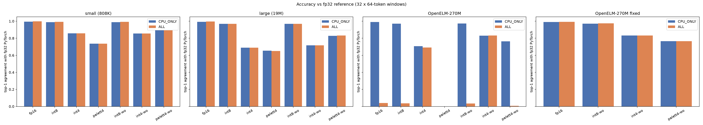
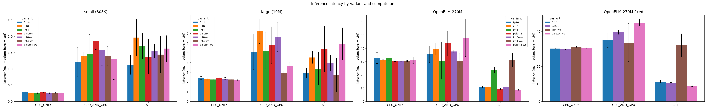
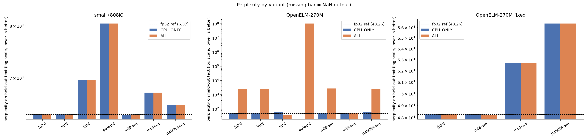
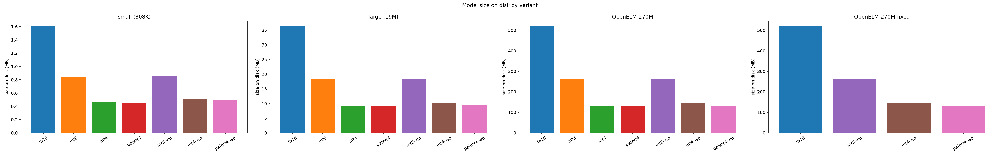

# llm-inference-macOS

Running transformer language models on Apple silicon with Core ML: conversion, compression, and where the models actually execute (CPU, GPU or Neural Engine), measured for latency, size and accuracy.

Three models are covered: a small transformer written and trained from scratch, a larger random-initialised version of it, and Apple's pretrained **OpenELM-270M**. Every claim below links to the script that measured it and that script's saved output in [`evidence/`](evidence).

## Key results

**OpenELM-270M gives wrong output on the Neural Engine after a standard Core ML conversion.** Core ML's fused attention op ignores the attention mask when it runs on the ANE, so each token also attends to the tokens after it. The same model file is correct on the CPU. Rewriting the attention as explicit matmul/softmax fixes it, and the model then runs correctly on the ANE at 2.7× CPU speed.

| OpenELM-270M | runs on | top-1 agreement with fp32 | perplexity | latency | size |
|---|---|---|---|---|---|
| fp32 PyTorch reference | – | 1.000 | 48.26 | – | – |
| fp16, `CPU_ONLY` | CPU | 0.990 | 48.26 | 30.2 ms | 518 MB |
| stock conversion, fp16, `ALL` | ANE | **0.041** | **2,498** | 10.9 ms | 518 MB |
| fixed conversion, fp16, `ALL` | ANE | 0.993 | 48.27 | 11.3 ms | 518 MB |
| **fixed, int8 weights, `ALL`** | ANE | **0.974** | **48.24** | **10.6 ms** | **260 MB** |
| fixed, 4-bit palettized weights, `ALL` | ANE | 0.765 | 56.38 | 9.0 ms | 131 MB |
| fixed, int4 weights, `ALL` | **GPU** | 0.832 | 52.67 | 32.1 ms | 146 MB |

- **int8 on the weights is the best overall choice:** it matches fp32 perplexity at half the size and slightly faster.
- **4-bit palettization is the smallest and fastest option but costs 17% perplexity.**
- **int4 is more accurate than palettization but slow:** Core ML runs it entirely on the GPU.




## Setup

| | |
|---|---|
| Hardware | Apple M4, 16 GB, macOS 26.6.2 |
| Libraries | Python 3.13, torch 2.7.0, coremltools 9.0, transformers 4.46.0 ([`evidence/environment.txt`](evidence/environment.txt)) |
| Deployment target | `ct.target.iOS18` for every model (int4 requires iOS18) |
| Input | 64 tokens, batch 1, fixed shape |

| Model | What it is | Params |
|---|---|---|
| small | Decoder-only transformer trained on tinyshakespeare (character-level, 4 layers) | 808K |
| large | Same architecture, 6 layers, d_model 512, random weights (latency only) | 19M |
| OpenELM-270M | Apple's pretrained model, stock conversion | 271M |
| OpenELM-270M fixed | Same weights, attention written out explicitly (F1) | 271M |

**Compute units.** `CPU_ONLY` runs on the CPU only. `CPU_AND_GPU` adds the GPU. `ALL` lets Core ML pick CPU, GPU or Neural Engine per op, and does not guarantee the ANE is used (F3).

**Compression variants** ([`compression.py`](compression.py))

| Label | Config |
|---|---|
| fp16 | Core ML default, no compression |
| int8 / int4 / palett4 | One config applied to every constant larger than 512 elements, default granularity (int per-channel; palettization uniform per-tensor) |
| int8-wo / int4-wo / palett4-wo | Only constants feeding `linear`/`matmul`/`gather` ops ("weights only"). int4 per-block (32); palettization k-means per-grouped-channel (16) |

**Accuracy** ([`evaluate_accuracy.py`](evaluate_accuracy.py)) is measured against the fp32 PyTorch model on 32 windows of 64 tokens from held-out tinyshakespeare text (the untrained large model gets random tokens). *Top-1 agreement* is the fraction of positions whose most likely next token matches the fp32 model's. *Perplexity* is measured on the true next token.

## Findings

### F1. The fused attention op ignores the attention mask on the Neural Engine

At the iOS18 target, PyTorch's `scaled_dot_product_attention` (SDPA) converts to a single fused Core ML op (F4). On the ANE, that op produced output as if there were no attention mask, for every mask form tried. OpenELM uses SDPA with a causal mask, so its output on `ALL` is wrong.

- **Every variant that runs on the ANE is wrong; the same files are fine on CPU.** Stock OpenELM fp16 has top-1 agreement 0.990 on `CPU_ONLY` and 0.041 on `ALL` (perplexity 2,498). The same pattern holds for int8, int8-wo and palett4-wo ([`e4`](evidence/e4_accuracy.txt)).
- **It breaks in the first layer.** Comparing hidden states layer by layer, the embeddings match on the ANE, but the first layer's output is already about 100% off; on CPU every layer is within 0.9% ([`e9`](evidence/e9_openelm_layer_bisect.txt)).
- **The error has the shape of an ignored causal mask.** In layer 0 it falls from 1.05 at position 0 to 0.012 at position 63, correlating 0.85 with the number of future tokens ([`e10`](evidence/e10_openelm_layer0_positions.txt)). Position 63 is allowed to see every token, so it's unaffected.
- **Minimal reproduction** ([`e11`](evidence/e11_sdpa_ane_repro.txt)): one attention layer with random weights, confirmed via `MLComputePlan` to run on the Neural Engine. Errors are relative to fp32 PyTorch; the CPU error is at most 0.0065 in every row.

| mask form | fused SDPA on ANE | explicit matmul/softmax on ANE |
|---|---|---|
| float mask (fp32-min values) | 0.988 | 0.0008 |
| float mask (finite −1e4) | 0.988 | 0.0008 |
| bool mask | 0.988 | 0.0008 |
| `is_causal=True` | 0.988 | 0.0008 |
| no mask (control) | 0.004 | 0.004 |

**Fix.** `convert_openelm.py --manual-attention` writes the attention out explicitly. The model still runs on the ANE (1,079 ANE ops and 7 CPU ops, [`e2`](evidence/e2_compute_plan.txt)), and its accuracy on `ALL` matches CPU for every variant ([`e4`](evidence/e4_accuracy.txt)).

**Explanations tested and ruled out**
- **fp16 overflow in RMSNorm.** OpenELM's activations reach 10,870, so `x²` inside RMSNorm overflows fp16 ([`e6`](evidence/e6_openelm_activation_range.txt)). An exactly equivalent overflow-safe RMSNorm didn't fix the ANE output ([`e7`](evidence/e7_safe_rmsnorm_conversion.txt)), and the ANE is already wrong in layer 0, before the large activations appear ([`e8`](evidence/e8_openelm_module_ranges.txt)).
- **`-inf` values in the mask.** A finite mask still fails (the second row above).

**Scope.** Seen on one machine and OS version. The same program is correct on the CPU, which points at how the ANE executes this op; other chips or OS versions weren't tested.

### F2. OpenELM needs a BOS token at position 0

With `<s>` as the first token, fp32 perplexity is 48.7; without it, 28,616, close to the 32,000-token vocabulary size, which is what random guessing would score ([`e5`](evidence/e5_openelm_bos.txt)). The damage covers the whole window, and the model is confidently wrong rather than uncertain (larger gaps between its top two logits). Accuracy measured without BOS is meaningless for this model.

### F3. `ComputeUnit.ALL` does not mean "runs on the Neural Engine"

Per-op placement from Core ML's own `MLComputePlan` (constants excluded; [`e2`](evidence/e2_compute_plan.txt), [`e2b`](evidence/e2b_ane_support.txt)):

| Model under `ALL` | ANE ops | GPU | CPU |
|---|---|---|---|
| small (naive / flash / SDPA attention) | 0 | 107 / 395 / 91 | 0 |
| large | 0 | 155 | 0 |
| OpenELM fp16 | 1015 | 0 | 7 |
| OpenELM fixed, int8-wo / palett4-wo | 1077 | 13 | 0 |
| OpenELM int4 (global, per-channel) | 125 | 879 | 22 |
| OpenELM int4-wo (per-block), stock or fixed | **0** | **1026 / 1090** | 0 |

- **The small and large models run entirely on the GPU** even though 100 of their 107 ops are ANE-capable. They have the same 7 ANE-unsupported ops as OpenELM (the embedding `gather` and its index handling), so op support doesn't explain it; Core ML's scheduler chose the GPU.
- **At 4 bits, linear quantization keeps OpenELM off the ANE and palettization doesn't.** Both int4 variants run mostly or entirely on the GPU, while int8 and 4-bit palettization stay on the ANE. This is why int4 is 2–3× slower on `ALL`.

### F4. At iOS18, PyTorch's SDPA becomes one fused Core ML op

Core ML ops in the converted program, for the same attention module converted at two deployment targets ([`e1`](evidence/e1_sdpa_lowering.txt)):

| target | manual attention | tiled "flash" attention | `F.scaled_dot_product_attention` |
|---|---|---|---|
| iOS17 | 10 ops | 128 ops | 10 ops, identical to manual |
| iOS18 | 10 ops | 128 ops | **1 op: `scaled_dot_product_attention`** |

The fused op is also more accurate on CPU/GPU (max error 0.0006 against 0.0040 for manual attention), but see F1 for its behaviour on the ANE.

### F5. Hand-written tiled ("flash") attention is slower at this context length

`FlashSelfAttention` in [`transformer.py`](transformer.py) is numerically equivalent to naive attention (max diff 4.8×10⁻⁷). After conversion it has 3.7× more executed ops (107 → 395) and is slower on every compute unit. Median latency of the small model ([`e12`](evidence/e12_attention_latency.txt)):

| attention | CPU_ONLY | CPU_AND_GPU | ALL |
|---|---|---|---|
| naive | 0.27 ms | 1.62 ms | 1.09 ms |
| flash (tiled) | 0.52 ms | 1.91 ms | 2.38 ms |
| SDPA (fused) | 0.62 ms | 1.27 ms | 1.21 ms |

At 64 tokens the attention matrix is only 64×64, so tiling has nothing to save and just adds ops. GPU timings vary by ±0.3–0.6 ms between runs.

### F6. A global compression config also compresses constants that aren't weights

With one config applied to every constant larger than 512 elements ([`e3`](evidence/e3_compressed_constants.txt)), OpenELM gets 36 non-weight constants compressed alongside its 85 weight matrices: 33 RMSNorm scale vectors, 2 RoPE sin/cos tables, and the causal mask, which holds 2,016 `-inf` values. The consequences:
- **k-means palettization crashes** (`Input X contains infinity`).
- **Uniform palettization produces NaN output** ([`e4`](evidence/e4_accuracy.txt)).

The coremltools palettization docs' own example uses this global pattern. The `-wo` variants compress a constant only when every op it feeds is a weight op. The configs are keyed by constant name, because type-based keys raise a config-conflict error when the converter merges identical constants.

### F7. Accuracy of each variant

`ALL` results, except where marked CPU (stock OpenELM, whose ANE output is wrong). Source: [`e4`](evidence/e4_accuracy.txt), [`accuracy_results.csv`](accuracy_results.csv).

| variant | small: agreement / ppl (ref 6.37) | large: agreement | OpenELM: agreement / ppl (ref 48.26) |
|---|---|---|---|
| fp16 | 0.998 / 6.375 | 0.996 | 0.993 / 48.27 |
| int8 (global) | 0.993 / 6.371 | 0.969 | 0.971 / 48.28 (CPU) |
| int8-wo | 0.993 / 6.371 | 0.969 | 0.974 / 48.24 |
| int4 (global, per-channel) | 0.858 / 6.966 | 0.689 | 0.707 / 60.71 (CPU) |
| int4-wo (per-block 32) | 0.855 / 6.743 | 0.716 | 0.832 / 52.67 |
| palett4 (global, uniform) | 0.736 / 8.048 | 0.651 | NaN (CPU) |
| palett4-wo (k-means, grouped 16) | 0.892 / 6.535 | 0.831 | 0.765 / 56.38 |

- **int8 is effectively lossless:** perplexity within 0.1% of fp32.
- **4-bit costs measurable accuracy even when configured well:** OpenELM int4-wo is +9% perplexity.
- **Configuration matters as much as bit-width:** weights-only per-block int4 beats global per-channel int4 on OpenELM (0.832 vs 0.707 agreement).
- **Neither 4-bit method is better everywhere:** palettization beats int4 on the small model but not on OpenELM.



### F8. Latency and size

Median of 50 `predict()` calls after 10 warmup calls. Source: [`e13`](evidence/e13_benchmark.txt), [`results.csv`](results.csv).

| model | variant | CPU_ONLY | CPU_AND_GPU | ALL | size |
|---|---|---|---|---|---|
| small | fp16 | 0.28 ms | 1.21 ms | 1.13 ms | 1.6 MB |
| small | palett4-wo | 0.26 | 1.30 | 1.63 | 0.50 |
| large | fp16 | 2.41 | 5.11 | 2.93 | 36.3 |
| large | int4-wo | 2.27 | 2.92 | 2.74 | 10.3 |
| OpenELM fixed | fp16 | 30.2 | 35.0 | **11.3** | 518 |
| OpenELM fixed | int8-wo | 29.9 | 39.5 | **10.6** | 260 |
| OpenELM fixed | int4-wo | 31.3 | 33.6 | 32.1 | 146 |
| OpenELM fixed | palett4-wo | 30.4 | 45.1 | **9.0** | 131 |

- **For the small and large models, CPU is fastest.** They never use the ANE, and at this size moving work to the GPU costs more than it saves.
- **For OpenELM, the ANE is 2.7× faster than CPU** once the output is correct.
- **Smaller isn't always faster:** int4 is smaller than int8 but 3× slower on `ALL`, because it runs on the GPU.



## Pitfalls that changed the conclusions

Earlier versions of these measurements pointed the wrong way. They're recorded because each is an easy mistake to repeat:

1. **The benchmark timed wrong output.** Stock OpenELM on the ANE looked like a clean 3× speedup, but its output was wrong. Latency results need an accuracy check next to them.
2. **Testing without BOS invalidated OpenELM's accuracy numbers.** Random-token inputs without BOS made fp16 and int4 look far worse than they are (F2).
3. **A single-input NaN check missed input-dependent NaNs.** Evaluation now uses 32 windows of real text.
4. **The global compression config did the damage, not the bit-width.** The int4 and palettization collapses came from compressing the mask and norm scales (F6), not from 4-bit itself.
5. **SDPA isn't decomposed at iOS18.** It's easy to assume coremltools breaks SDPA into matmul/softmax; that's only true at iOS17 and below (F4).

Practical fixes needed along the way:

| Problem | Fix |
|---|---|
| `ct.convert` fails on an `int` op (`only 0-dimensional arrays can be converted`) | Remove shape-dependent code (`x.size(1)`, `key.shape[2]`) from the traced path; see `ExportDecoderOnlyTransformer` and `patch_rope` |
| OpenELM fails to load on recent transformers (`unexpected keyword argument 'use_cache'`) | Pin `transformers==4.46.0` |
| Segfault when loading many Core ML models in one process | `del model; gc.collect()` between loads |
| `MLComputePlan` reports "model not found" | Keep the `MLModel` object alive while reading its compiled path |
| `ValueError: Pool not running` in k-means palettization | `num_kmeans_workers=1` |

## Repository layout

| File | Purpose |
|---|---|
| [`transformer.py`](transformer.py) | Decoder-only transformer: naive, tiled "flash" and SDPA attention, plus an export variant with fixed shapes |
| [`train.py`](train.py) | Trains the small model on tinyshakespeare |
| [`convert_to_coreml.py`](convert_to_coreml.py) | Converts the small model |
| [`convert_attention_variants.py`](convert_attention_variants.py) | Converts the flash and SDPA versions of the small model |
| [`convert_large.py`](convert_large.py) | Converts the random-initialised large model |
| [`convert_openelm.py`](convert_openelm.py) | Converts OpenELM-270M; `--manual-attention` applies the ANE fix |
| [`compression.py`](compression.py) | All int8 / int4 / palettization configs |
| [`benchmark.py`](benchmark.py) | Latency and size across variants and compute units |
| [`benchmark_attention.py`](benchmark_attention.py) | Latency of naive vs flash vs SDPA attention |
| [`evaluate_accuracy.py`](evaluate_accuracy.py) | Accuracy of every variant against fp32 PyTorch |
| [`evidence/`](evidence) | One script per finding (`eN_*.py`) with its saved output (`eN_*.txt`) |

## Reproducing

```bash
pip install -r requirements.txt
curl -o tinyshakespeare.txt https://raw.githubusercontent.com/karpathy/char-rnn/master/data/tinyshakespeare/input.txt

python train.py                                # small model -> checkpoint.pt
python convert_to_coreml.py                    # small model, naive attention
python convert_attention_variants.py           # small model, flash + SDPA attention
python convert_large.py                        # large model, random init
python convert_openelm.py                      # OpenELM, stock conversion
python convert_openelm.py --manual-attention   # OpenELM, fixed
python benchmark.py                            # builds compression variants; latency + size
python evaluate_accuracy.py                    # accuracy vs fp32
python benchmark_attention.py
python evidence/e1_sdpa_lowering.py            # ...and each other evidence/eN script
```

The converted models (up to 518 MB each) and the trained checkpoint aren't in the repo; the commands above rebuild them. The k-means palettization of OpenELM takes about 7 minutes. `e10` uses the per-layer model built by `e9`. [`e7`](evidence/e7_safe_rmsnorm_conversion.txt) is the output of `convert_openelm.py --safe-rmsnorm`.

## Limitations

- One machine (M4) and one OS version; ANE behaviour in particular may differ elsewhere.
- Latency is `MLModel.predict()` wall time from Python, including Python overhead. Size is on disk, not runtime memory.
- 64-token context, batch 1, single forward pass. No KV cache or autoregressive decoding.
- The large model is untrained, so only its latency and agreement with its own fp32 output mean anything.
- OpenELM perplexity is measured on Shakespeare, which is out of domain; use it to compare variants, not as an absolute score.
- OpenELM's tokenizer is loaded from `hf-internal-testing/llama-tokenizer`, a public copy of the Llama-2 tokenizer (Meta's original is gated).
